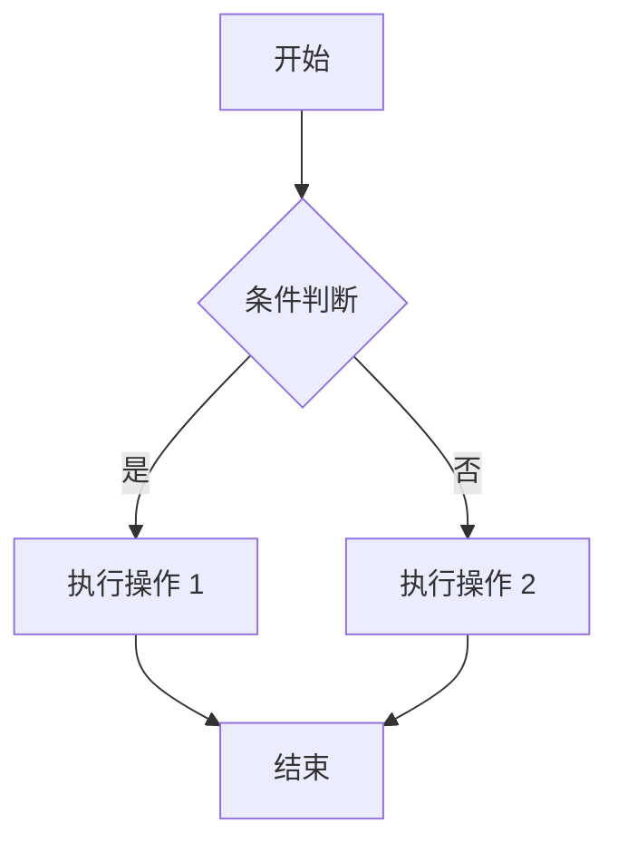
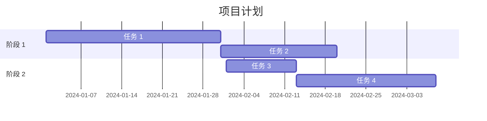
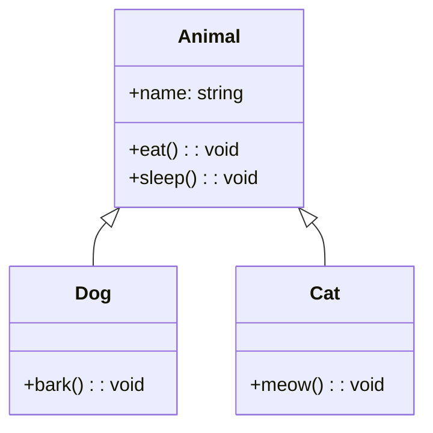
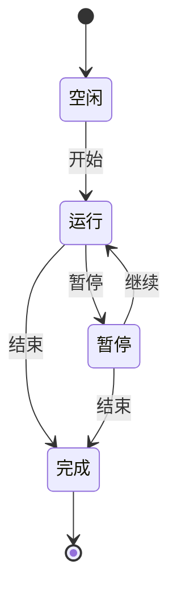
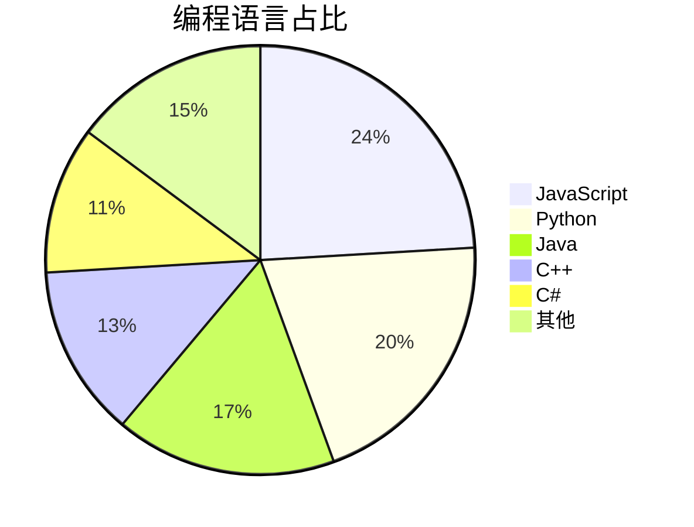
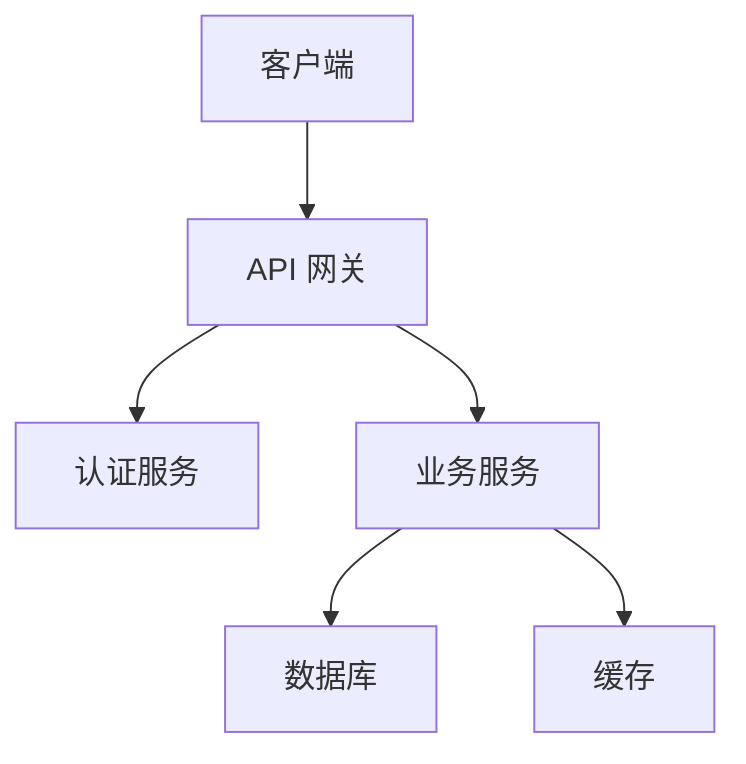

# Markdown 完全指南

## 1. 什么是 Markdown

Markdown 是一种轻量级标记语言，由 John Gruber 和 Aaron Swartz 于 2004 年创建。它允许人们使用易读易写的纯文本格式编写文档，然后转换为 HTML 等结构化格式。

### 1.1 特点
- **易读易写**：使用简单的标记语法，无需复杂的 HTML 标签
- **跨平台**：支持几乎所有文本编辑器和平台
- **可转换**：可以转换为 HTML、PDF、Word 等多种格式
- **广泛支持**：GitHub、GitLab、Stack Overflow 等平台都支持 Markdown
- **专注内容**：让作者专注于内容创作，而非排版

### 1.2 应用场景
- 编写 README 文件
- 撰写技术文档
- 发布博客文章
- 编写邮件
- 创建演示文稿
- 编写电子书
- 团队协作文档

## 2. 基础语法

### 2.1 标题

Markdown 支持六级标题，使用 `#` 符号表示：

```markdown
# 一级标题
## 二级标题
### 三级标题
#### 四级标题
##### 五级标题
###### 六级标题
```

### 2.2 段落和换行

- 段落：直接输入文本，段落之间用一个或多个空行分隔
- 换行：在行尾添加两个或多个空格，然后按回车

```markdown
这是第一个段落。

这是第二个段落，与第一个段落之间有一个空行。

这是第三行，  
这是第四行，使用两个空格实现换行。
```

### 2.3 强调

#### 2.3.1 斜体
使用 `*` 或 `_` 包裹文本：

```markdown
*斜体文本* 或 _斜体文本_
```

#### 2.3.2 粗体
使用 `**` 或 `__` 包裹文本：

```markdown
**粗体文本** 或 __粗体文本__
```

#### 2.3.3 粗斜体
使用 `***` 或 `___` 包裹文本：

```markdown
***粗斜体文本*** 或 ___粗斜体文本___
```

### 2.4 列表

#### 2.4.1 无序列表
使用 `-`、`*` 或 `+` 表示：

```markdown
- 列表项 1
- 列表项 2
  - 子列表项 2.1
  - 子列表项 2.2
    - 孙列表项 2.2.1

* 列表项 A
* 列表项 B

+ 列表项 X
+ 列表项 Y
```

#### 2.4.2 有序列表
使用数字加 `.` 表示：

```markdown
1. 第一项
2. 第二项
   1. 子项 2.1
   2. 子项 2.2
3. 第三项
```

#### 2.4.3 任务列表
使用 `- [ ]` 表示未完成任务，`- [x]` 表示已完成任务：

```markdown
- [x] 已完成任务 1
- [x] 已完成任务 2
- [ ] 未完成任务 3
- [ ] 未完成任务 4
```

### 2.5 链接

#### 2.5.1 行内链接
```markdown
[链接文本](链接地址 "可选标题")

示例：
[GitHub](https://github.com "GitHub 官网")
```

#### 2.5.2 参考链接
```markdown
[链接文本][链接标识]

[链接标识]: 链接地址 "可选标题"

示例：
[GitHub][gh]
[Google][gg]

[gh]: https://github.com "GitHub 官网"
[gg]: https://www.google.com "Google 官网"
```

#### 2.5.3 自动链接
```markdown
<https://github.com>
<example@example.com>
```

### 2.6 图片

#### 2.6.1 行内图片
```markdown


示例：

```

#### 2.6.2 参考图片
```markdown
![替代文本][图片标识]

[图片标识]: 图片地址 "可选标题"

示例：
![GitHub Logo][github-logo]

[github-logo]: https://github.githubassets.com/images/modules/logos_page/GitHub-Mark.png "GitHub Logo"
```

### 2.7 引用

使用 `>` 表示引用：

```markdown
> 这是一个引用块。
> 引用可以包含多行文本。

> 一级引用
> > 二级引用
> > > 三级引用

> 引用中可以包含 **粗体** 和 *斜体* 等格式。
```

### 2.8 代码

#### 2.8.1 行内代码
使用反引号 `` ` `` 包裹代码：

```markdown
这是一个行内代码 `print("Hello World!")` 示例。
```

#### 2.8.2 代码块
使用三个反引号 `` ``` `` 包裹代码块，并可以指定语言：

```markdown
```python
print("Hello World!")
def add(a, b):
    return a + b
```

```javascript
console.log("Hello World!");
function add(a, b) {
    return a + b;
}
```
```

### 2.9 分隔线

使用三个或更多的 `-`、`*` 或 `_` 表示分隔线：

```markdown
---
***
___
```

### 2.10 表格

使用 `|` 分隔列，`-` 分隔表头和内容：

```markdown
| 表头 1 | 表头 2 | 表头 3 |
|--------|--------|--------|
| 内容 1 | 内容 2 | 内容 3 |
| 内容 4 | 内容 5 | 内容 6 |
```

#### 2.10.1 对齐方式

```markdown
| 左对齐 | 居中对齐 | 右对齐 |
|:-------|:--------:|-------:|
| 内容 1 | 内容 2   | 内容 3 |
| 内容 4 | 内容 5   | 内容 6 |
```

### 2.11 转义字符

使用 `\` 转义特殊字符：

```markdown
\* 这不是斜体 \*
\# 这不是标题
\[ 这不是链接开始
\] 这不是链接结束
\( 这不是图片开始
\) 这不是图片结束
\` 这不是代码开始
\~ 这不是删除线开始
\_ 这不是下划线
```

### 2.12 删除线

使用 `~~` 包裹文本：

```markdown
~~删除的文本~~
```

### 2.13 脚注

```markdown
这是一个带有脚注的文本[^1]。

[^1]: 这是脚注的内容。
```

## 3. 高级语法

### 3.1 目录

使用 `[toc]` 或类似语法生成目录，具体取决于 Markdown 编辑器：

```markdown
[toc]
```

### 3.2 数学公式

#### 3.2.1 行内公式
使用 `$` 包裹公式：

```markdown
这是一个行内公式 $E = mc^2$。
```

#### 3.2.2 块级公式
使用 `$$` 包裹公式：

```markdown
$$
E = mc^2
$$

$$
\int_{a}^{b} f(x) dx
$$
```

### 3.3 流程图

```markdown

```

### 3.4 序列图

```markdown
```mermaid
sequenceDiagram
    参与者 客户端
    参与者 服务器
    
    客户端->>服务器: 请求数据
    服务器-->>客户端: 返回响应
    客户端->>服务器: 再次请求
    服务器-->>客户端: 再次返回
```
```

### 3.5 甘特图

```markdown

```

### 3.6 类图

```markdown

```

### 3.7 状态图

```markdown

```

### 3.8 饼图

```markdown

```

### 3.9 定义列表

```markdown
术语 1
: 术语 1 的解释 1
: 术语 1 的解释 2

术语 2
: 术语 2 的解释 1
```

### 3.10 高亮

使用 `==` 包裹文本实现高亮（某些编辑器支持）：

```markdown
==高亮文本==
```

### 3.11 注释

Markdown 支持 HTML 注释：

```markdown
<!-- 这是一个注释，不会在最终渲染中显示 -->
```

## 4. Markdown 编辑器推荐

### 4.1 桌面编辑器

| 编辑器 | 平台 | 特点 |
|--------|------|------|
| Typora | Windows/macOS/Linux | 所见即所得，简洁美观 |
| VS Code | Windows/macOS/Linux | 功能强大，插件丰富 |
| Sublime Text | Windows/macOS/Linux | 轻量快速，自定义性强 |
| Atom | Windows/macOS/Linux | 开源免费，插件丰富 |
| Notepad++ | Windows | 轻量快速，适合 Windows 用户 |

### 4.2 在线编辑器

| 编辑器 | 特点 |
|--------|------|
| GitHub Gist | 适合分享代码片段 |
| GitLab Snippets | 类似 GitHub Gist |
| StackEdit | 功能丰富，支持云同步 |
| Dillinger | 简洁易用，支持多种导出格式 |
| Markdown Live Preview | 实时预览，简洁易用 |

### 4.3 协作工具

| 工具 | 特点 |
|------|------|
| Notion | 集成 Markdown，功能丰富 |
| Confluence | 企业级协作，支持 Markdown |
| GitBook | 适合编写文档和电子书 |
| Docsify | 轻量级文档网站生成工具 |
| VuePress | 基于 Vue 的静态网站生成器 |
| MkDocs | 基于 Python 的静态网站生成器 |

## 5. 最佳实践

### 5.1 语法规范

- 统一使用一种列表符号（推荐使用 `-` 表示无序列表）
- 标题层级清晰，不要跳过层级
- 代码块指定语言，便于语法高亮
- 表格使用对齐方式，提高可读性
- 合理使用空行分隔不同内容块
- 避免过长行，建议每行不超过 80 个字符

### 5.2 内容组织

- 使用清晰的标题结构
- 每个段落只包含一个主题
- 使用列表和表格使内容更清晰
- 适当使用引用强调重要内容
- 使用代码块展示代码示例
- 添加图片和图表增强可视化效果

### 5.3 协作规范

- 统一使用 Markdown 格式
- 建立文档目录结构
- 使用版本控制管理文档
- 定期更新和维护文档
- 明确文档责任人
- 建立文档评审机制

### 5.4 性能优化

- 图片使用适当的尺寸和格式
- 大型文档考虑拆分多个文件
- 使用 CDN 加速图片加载
- 避免过多的复杂图表

## 6. 常见问题

### 6.1 Markdown 渲染不一致

问题：不同的 Markdown 编辑器或平台渲染结果不一致。

解决方案：
- 只使用标准 Markdown 语法
- 避免使用编辑器特定的扩展语法
- 测试在目标平台的渲染效果
- 使用 Markdown 规范检查工具

### 6.2 特殊字符处理

问题：某些特殊字符无法正确显示。

解决方案：
- 使用转义字符处理特殊字符
- 对于复杂公式，考虑使用数学公式语法

### 6.3 表格对齐问题

问题：表格在不同编辑器中对齐不一致。

解决方案：
- 使用等宽字体编辑器
- 手动调整表格列宽
- 考虑使用在线表格生成工具

### 6.4 图片路径问题

问题：图片在不同设备或平台上无法显示。

解决方案：
- 使用相对路径或绝对路径
- 考虑使用图床服务
- 对于协作文档，使用在线图片托管

## 7. 扩展和插件

### 7.1 VS Code 插件

- **Markdown All in One**：提供丰富的 Markdown 编辑功能
- **Markdown Preview Enhanced**：增强的 Markdown 预览功能
- **Paste Image**：快速粘贴图片到 Markdown 文档
- **Markdown Lint**：检查 Markdown 语法规范
- **Mermaid Preview**：预览 Mermaid 图表

### 7.2 其他扩展

- **GFM (GitHub Flavored Markdown)**：GitHub 扩展的 Markdown 语法
- **CommonMark**：标准化的 Markdown 规范
- **MultiMarkdown**：扩展了标准 Markdown，增加了表格、脚注等功能
- **AsciiDoc**：类似 Markdown 的轻量级标记语言，功能更丰富

## 8. 示例文档

### 8.1 项目 README 示例

```markdown
# 项目名称

## 项目简介

这是一个示例项目，用于演示 Markdown 文档的编写。

## 功能特性

- 功能 1
- 功能 2
- 功能 3

## 安装说明

### 环境要求

- Python 3.9+
- Node.js 14+

### 安装步骤

1. 克隆仓库
   ```bash
   git clone https://github.com/username/repo.git
   cd repo
   ```

2. 安装依赖
   ```bash
   pip install -r requirements.txt
   npm install
   ```

3. 运行项目
   ```bash
   python main.py
   ```

## 使用指南

### 基本用法

```python
from mypackage import MyClass

obj = MyClass()
obj.method()
```

### 高级用法

详细的高级用法说明...

## 贡献指南

欢迎提交 Issue 和 Pull Request！

## 许可证

MIT License

## 联系方式

- 作者：示例作者
- 邮箱：example@example.com
- GitHub：[username](https://github.com/username)
```

### 8.2 技术文档示例

```markdown
# 技术文档

## 1. 概述

### 1.1 文档目的

本文档详细介绍了 XXX 系统的设计和实现。

### 1.2 术语定义

| 术语 | 解释 |
|------|------|
| API | 应用程序编程接口 |
| SDK | 软件开发工具包 |
| JSON | JavaScript 对象表示法 |

## 2. 系统架构

### 2.1 架构图



### 2.2 模块划分

- 模块 1：负责 XXX 功能
- 模块 2：负责 XXX 功能
- 模块 3：负责 XXX 功能

## 3. 详细设计

### 3.1 数据库设计

#### 3.1.1 表结构

| 字段名 | 数据类型 | 约束 | 描述 |
|--------|----------|------|------|
| id | INT | PRIMARY KEY | 主键 |
| name | VARCHAR(255) | NOT NULL | 名称 |
| created_at | DATETIME | NOT NULL | 创建时间 |
| updated_at | DATETIME | NOT NULL | 更新时间 |

### 3.2 API 设计

#### 3.2.1 接口列表

| 接口名称 | 请求方法 | 路径 | 功能描述 |
|----------|----------|------|----------|
| 获取列表 | GET | /api/items | 获取项目列表 |
| 获取详情 | GET | /api/items/:id | 获取项目详情 |
| 创建项目 | POST | /api/items | 创建新项目 |
| 更新项目 | PUT | /api/items/:id | 更新项目 |
| 删除项目 | DELETE | /api/items/:id | 删除项目 |

## 4. 部署说明

### 4.1 环境准备

- 操作系统：Ubuntu 20.04+
- 数据库：MySQL 8.0+
- Web 服务器：Nginx 1.18+

### 4.2 部署步骤

1. 安装依赖
   ```bash
   sudo apt update
   sudo apt install nginx mysql-server
   ```

2. 配置 Nginx
   ```nginx
   server {
       listen 80;
       server_name example.com;
       
       location / {
           proxy_pass http://localhost:3000;
           proxy_http_version 1.1;
           proxy_set_header Upgrade $http_upgrade;
           proxy_set_header Connection 'upgrade';
           proxy_set_header Host $host;
           proxy_cache_bypass $http_upgrade;
       }
   }
   ```

3. 启动服务
   ```bash
   sudo systemctl start nginx
   sudo systemctl start mysql
   ```

## 5. 监控和维护

### 5.1 日志管理

- 应用日志：/var/log/app.log
- Nginx 日志：/var/log/nginx/access.log, /var/log/nginx/error.log
- MySQL 日志：/var/log/mysql/mysql.log

### 5.2 常见问题

| 问题 | 解决方案 |
|------|----------|
| 服务无法启动 | 检查配置文件和日志 |
| 数据库连接失败 | 检查数据库服务和连接参数 |
| API 响应缓慢 | 检查服务器资源和数据库查询 |
```

## 9. 总结

Markdown 是一种简单易用的标记语言，适合编写各种类型的文档。通过学习 Markdown 语法和最佳实践，你可以提高文档编写的效率和质量。

在实际使用中，建议：
1. 选择适合自己的 Markdown 编辑器
2. 遵循 Markdown 语法规范
3. 合理组织文档结构
4. 利用扩展和插件增强功能
5. 定期更新和维护文档

通过不断练习和实践，你将能够编写高质量的 Markdown 文档，提高工作效率和协作效果。