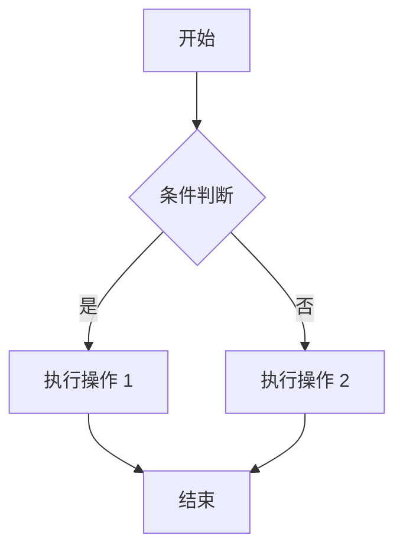
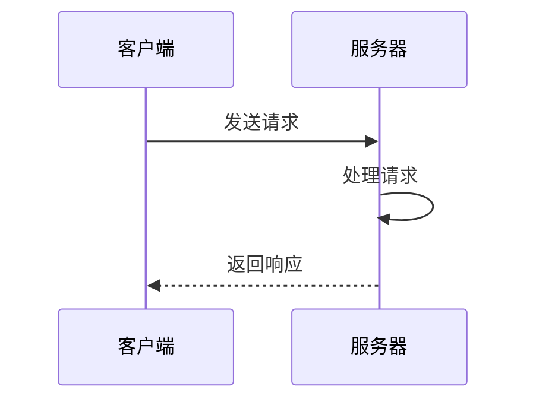
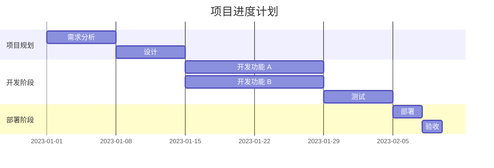

# Markdown 高级用法

## 1. 概述

除了基础语法外，Markdown 还有许多扩展语法，这些扩展语法由不同的实现（如 GitHub Flavored Markdown、CommonMark、GitLab Flavored Markdown 等）提供，用于实现更丰富的功能，如表格、任务列表、数学公式、图表、流程图等。

本文将介绍一些常用的 Markdown 高级用法，帮助您编写更丰富、更专业的文档。

## 2. GitHub Flavored Markdown (GFM)

GitHub Flavored Markdown (GFM) 是 GitHub 对 Markdown 的扩展，增加了许多实用的功能，被广泛应用于 GitHub 上的 README 文件、Issue 和 Pull Request 中。

### 2.1 任务列表

任务列表是 GFM 的一个扩展功能，用于创建带有复选框的列表。

**语法示例**：

```markdown
- [x] 已完成的任务
- [ ] 未完成的任务
- [ ] 另一个未完成的任务

1. [x] 已完成的有序任务
2. [ ] 未完成的有序任务
```

**显示效果**：

- [x] 已完成的任务
- [ ] 未完成的任务
- [ ] 另一个未完成的任务

1. [x] 已完成的有序任务
2. [ ] 未完成的有序任务

### 2.2 代码块语法高亮

GFM 支持在代码块中指定语言，实现语法高亮。

**语法示例**：

````markdown
```javascript
// JavaScript 代码示例
function hello() {
  console.log("Hello, GFM!");
}

// 调用函数
hello();
```

```python
# Python 代码示例
def hello():
    print("Hello, GFM!")

# 调用函数
hello()
```

```java
// Java 代码示例
public class HelloGFM {
    public static void main(String[] args) {
        System.out.println("Hello, GFM!");
    }
}
```
````

### 2.3 自动链接

GFM 会自动将 URL 转换为可点击的链接，无需使用 `<>` 包裹。

**语法示例**：

```markdown
访问 https://github.com 了解更多信息。

发送邮件到 example@example.com 联系我们。
```

**显示效果**：

访问 https://github.com 了解更多信息。

发送邮件到 example@example.com 联系我们。

### 2.4 表格

GFM 支持创建表格，这是 Markdown 基础语法中已经介绍过的功能。

### 2.5 删除线

使用 `~~` 包裹文本表示删除线。

**语法示例**：

```markdown
这是 ~~删除的文本~~，这是正常的文本。
```

**显示效果**：

这是 ~~删除的文本~~，这是正常的文本。

### 2.6 表情符号 (Emoji)

GFM 支持在文本中使用表情符号，可以通过短代码或直接插入表情符号。

**语法示例**：

```markdown
这是一个笑脸表情 :smile:，
这是一个庆祝表情 :tada:，
这是一个点赞表情 :thumbsup:。

也可以直接插入表情符号：😊🎉👍
```

**显示效果**：

这是一个笑脸表情 :smile:，
这是一个庆祝表情 :tada:，
这是一个点赞表情 :thumbsup:。

也可以直接插入表情符号：😊🎉👍

## 3. 数学公式

许多 Markdown 编辑器支持使用 LaTeX 语法编写数学公式，包括行内公式和块级公式。

### 3.1 行内公式

使用 `$` 包裹数学公式表示行内公式。

**语法示例**：

```markdown
行内公式：$E = mc^2$ 是爱因斯坦的质能方程。

另一个行内公式：$\sum_{i=1}^{n} i = \frac{n(n+1)}{2}$ 是等差数列求和公式。
```

**显示效果**：

行内公式：$E = mc^2$ 是爱因斯坦的质能方程。

另一个行内公式：$\sum_{i=1}^{n} i = \frac{n(n+1)}{2}$ 是等差数列求和公式。

### 3.2 块级公式

使用 `$$` 包裹数学公式表示块级公式。

**语法示例**：

```markdown
块级公式：

$$
E = mc^2
$$

另一个块级公式：

$$
\int_{-\infty}^{\infty} e^{-x^2} dx = \sqrt{\pi}
$$
```

**显示效果**：

块级公式：

$$
E = mc^2
$$

另一个块级公式：

$$
\int_{-\infty}^{\infty} e^{-x^2} dx = \sqrt{\pi}
$$

## 4. 图表和流程图

一些 Markdown 编辑器（如 Typora、VS Code 插件等）支持使用 Mermaid、PlantUML 等语法创建图表和流程图。

### 4.1 Mermaid 流程图

Mermaid 是一个用于生成图表的 JavaScript 库，支持流程图、序列图、甘特图等多种图表类型。

**语法示例**：



**显示效果**：


### 4.2 Mermaid 序列图



**显示效果**：


### 4.3 Mermaid 甘特图



**显示效果**：


## 5. 目录

一些 Markdown 编辑器支持自动生成目录，可以通过 `[toc]` 或类似语法生成。

**语法示例**：

```markdown
[toc]

# 第一章
## 1.1 小节
## 1.2 小节

# 第二章
## 2.1 小节
## 2.2 小节
```

**显示效果**：

[toc]

# 第一章
## 1.1 小节
## 1.2 小节

# 第二章
## 2.1 小节
## 2.2 小节

## 6. 折叠内容

一些 Markdown 编辑器支持折叠内容，用于隐藏详细信息，只显示标题。

**语法示例**：

```markdown<details>
<summary>点击展开详细内容</summary>

这是隐藏的详细内容，可以包含 **粗体**、*斜体* 等格式，
以及列表、代码块等内容。

- 列表项 1
- 列表项 2

```javascript
console.log("Hello, 折叠内容!");
```
</details>
```

**显示效果**：

<details>
<summary>点击展开详细内容</summary>

这是隐藏的详细内容，可以包含 **粗体**、*斜体* 等格式，
以及列表、代码块等内容。

- 列表项 1
- 列表项 2

```javascript
console.log("Hello, 折叠内容!");
```
</details>

## 7. 自定义容器

一些 Markdown 编辑器支持自定义容器，用于突出显示特定内容，如提示、警告、错误等。

**语法示例**：

```markdown
::: tip 提示
这是一条提示信息。
:::

::: warning 警告
这是一条警告信息。
:::

::: danger 错误
这是一条错误信息。
:::

::: info 信息
这是一条普通信息。
:::
```

**显示效果**：

::: tip 提示
这是一条提示信息。
:::

::: warning 警告
这是一条警告信息。
:::

::: danger 错误
这是一条错误信息。
:::

::: info 信息
这是一条普通信息。
:::

## 8. 内联 HTML

Markdown 支持直接嵌入 HTML 代码，用于实现 Markdown 语法无法实现的功能。

**语法示例**：

```markdown
这是一段普通的 Markdown 文本。

<div style="background-color: #f0f0f0; padding: 10px; border-radius: 5px;">
  这是一段使用 HTML 样式的文本，背景色为浅灰色，带有内边距和圆角。
</div>

<table style="border-collapse: collapse; width: 100%;">
  <tr style="background-color: #e0e0e0;">
    <th style="border: 1px solid #ddd; padding: 8px;">表头 1</th>
    <th style="border: 1px solid #ddd; padding: 8px;">表头 2</th>
  </tr>
  <tr>
    <td style="border: 1px solid #ddd; padding: 8px;">内容 1</td>
    <td style="border: 1px solid #ddd; padding: 8px;">内容 2</td>
  </tr>
</table>
```

**显示效果**：

这是一段普通的 Markdown 文本。

<div style="background-color: #f0f0f0; padding: 10px; border-radius: 5px;">
  这是一段使用 HTML 样式的文本，背景色为浅灰色，带有内边距和圆角。
</div>

<table style="border-collapse: collapse; width: 100%;">
  <tr style="background-color: #e0e0e0;">
    <th style="border: 1px solid #ddd; padding: 8px;">表头 1</th>
    <th style="border: 1px solid #ddd; padding: 8px;">表头 2</th>
  </tr>
  <tr>
    <td style="border: 1px solid #ddd; padding: 8px;">内容 1</td>
    <td style="border: 1px solid #ddd; padding: 8px;">内容 2</td>
  </tr>
</table>

## 9. 导出和转换

Markdown 文档可以转换为多种格式，如 HTML、PDF、Word 等，方便在不同场景下使用。

### 9.1 转换为 HTML

使用 `pandoc`、`marked` 等工具可以将 Markdown 转换为 HTML：

```bash
# 使用 pandoc 转换
pandoc input.md -o output.html

# 使用 marked 转换
marked input.md -o output.html
```

### 9.2 转换为 PDF

使用 `pandoc`、`wkhtmltopdf` 等工具可以将 Markdown 转换为 PDF：

```bash
# 使用 pandoc 转换
pandoc input.md -o output.pdf

# 使用 wkhtmltopdf 转换
markdown input.md | wkhtmltopdf - output.pdf
```

### 9.3 转换为 Word

使用 `pandoc` 可以将 Markdown 转换为 Word 文档：

```bash
pandoc input.md -o output.docx
```

## 10. 总结

Markdown 高级用法扩展了 Markdown 的功能，使其能够处理更复杂的文档需求，如数学公式、图表、流程图等。不同的 Markdown 实现可能支持不同的扩展语法，因此在使用时需要了解您所使用的编辑器或工具支持哪些扩展功能。

通过掌握 Markdown 高级用法，可以编写更丰富、更专业的文档，满足不同场景的需求。同时，Markdown 的扩展性也使得它能够适应不断变化的文档需求，是一种非常灵活和强大的标记语言。