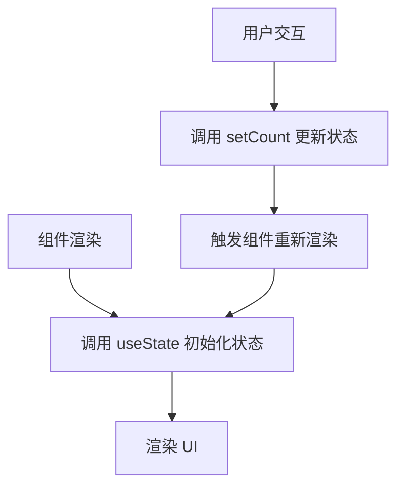
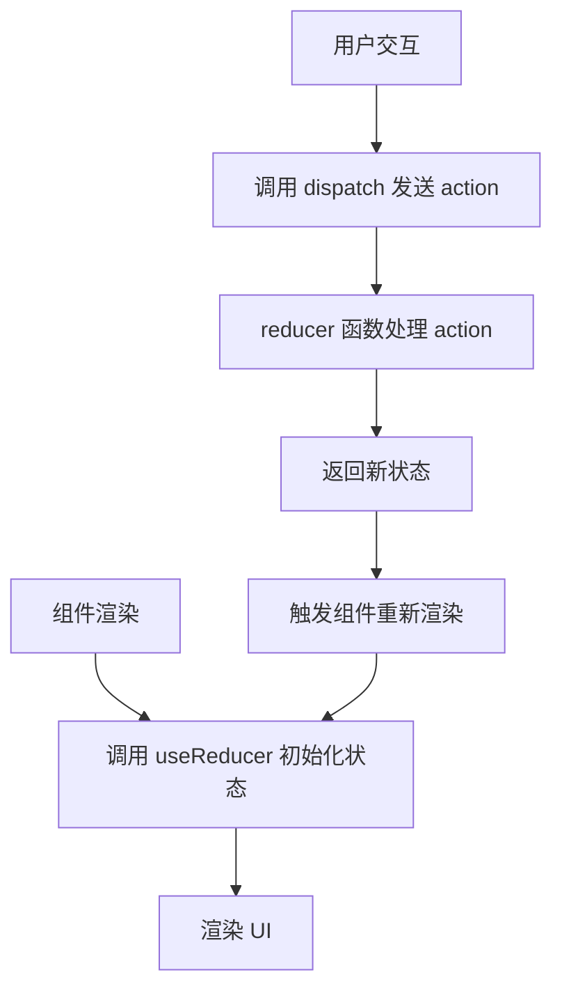
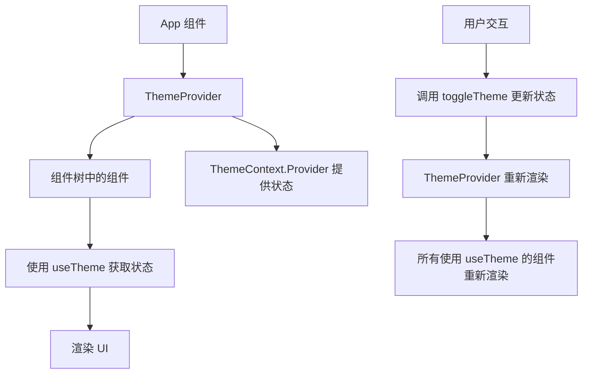
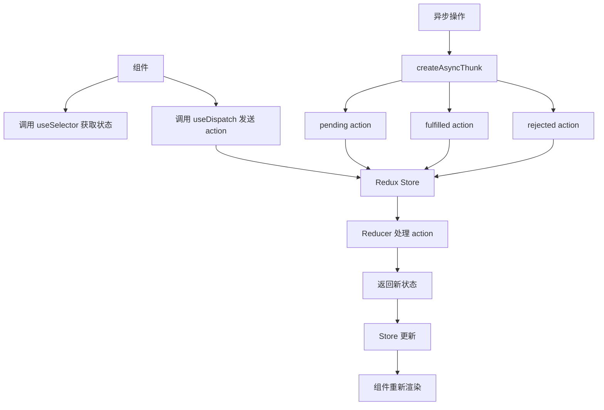
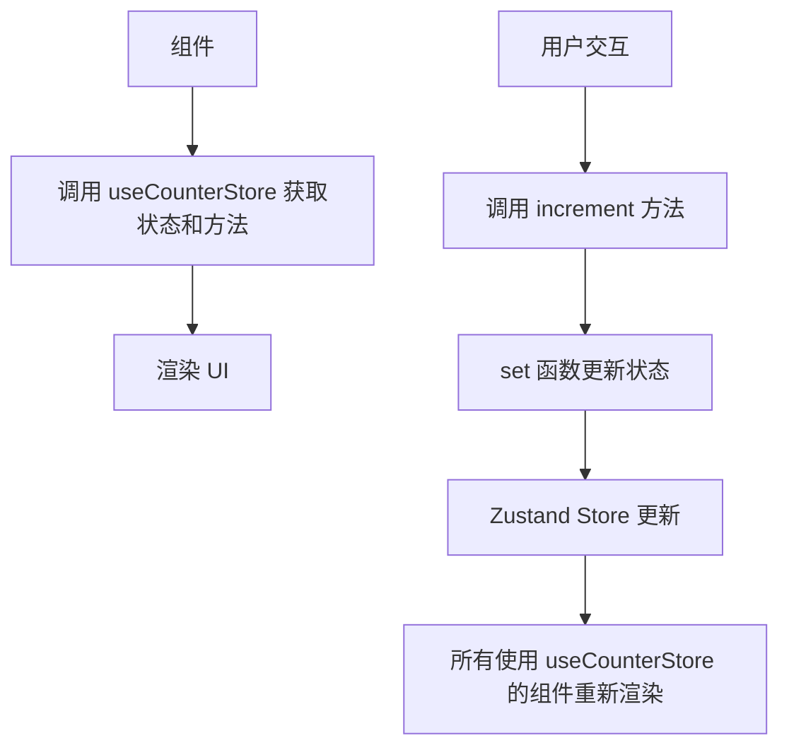
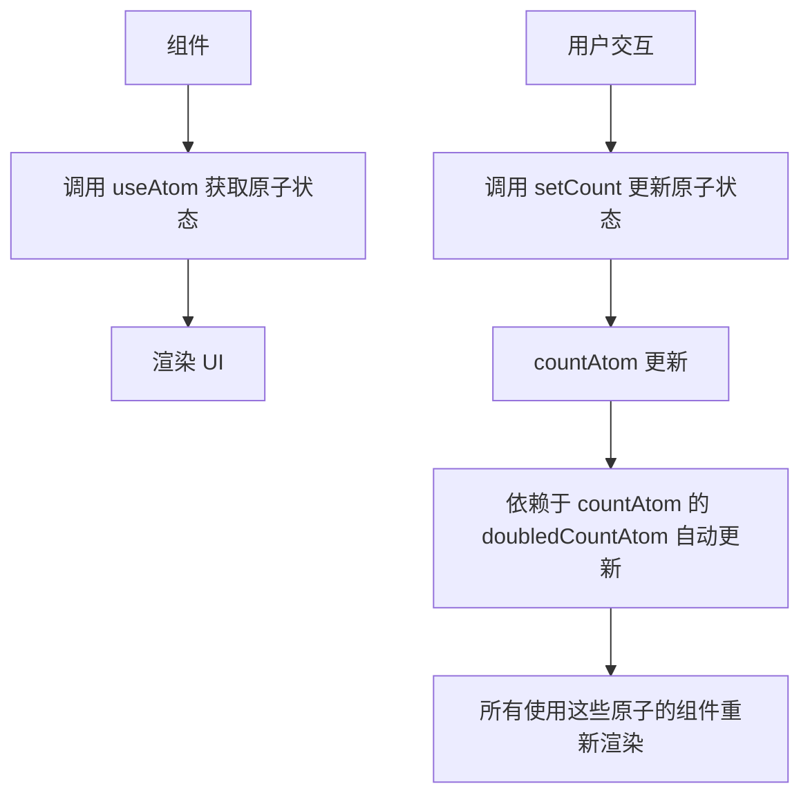

# React 状态管理

## 1. 概述

状态管理是 React 应用开发中的核心概念之一，它决定了如何管理和共享应用中的数据。随着应用规模的增长，状态管理变得越来越复杂，需要选择合适的状态管理方案来确保应用的可维护性和性能。

本文档将介绍 React 中的各种状态管理方案，包括：
- React 内置的状态管理（useState, useReducer, Context API）
- 第三方状态管理库（Redux Toolkit, Zustand, Jotai, Recoil）
- 状态管理的最佳实践
- 性能优化

## 2. React 内置状态管理

### 2.1 useState

`useState` 是 React 中最基本的状态管理 Hook，用于在函数组件中添加本地状态。

#### 2.1.1 基本用法

```jsx
import { useState } from 'react';

const Counter = () => {
  const [count, setCount] = useState(0);
  
  const increment = () => {
    setCount(count + 1);
  };
  
  const decrement = () => {
    setCount(count - 1);
  };
  
  return (
    <div>
      <h2>计数器: {count}</h2>
      <button onClick={increment}>+</button>
      <button onClick={decrement}>-</button>
    </div>
  );
};
```

#### 2.1.2 useState 工作原理



#### 2.1.3 最佳实践

- 使用多个 useState 而不是单个复杂对象
- 使用描述性的状态变量名
- 避免不必要的状态更新
- 对于数组和对象，使用函数式更新确保获取最新状态

```jsx
// 函数式更新示例
const [todos, setTodos] = useState([]);

const addTodo = (todo) => {
  setTodos(prevTodos => [...prevTodos, todo]);
};
```

### 2.2 useReducer

`useReducer` 是另一个内置的状态管理 Hook，适用于管理复杂的状态逻辑，类似于 Redux 的工作方式。

#### 2.2.1 基本用法

```jsx
import { useReducer } from 'react';

// 定义 reducer 函数
const counterReducer = (state, action) => {
  switch (action.type) {
    case 'INCREMENT':
      return { count: state.count + 1 };
    case 'DECREMENT':
      return { count: state.count - 1 };
    case 'RESET':
      return { count: 0 };
    default:
      return state;
  }
};

const Counter = () => {
  // 初始化 useReducer
  const [state, dispatch] = useReducer(counterReducer, { count: 0 });
  
  return (
    <div>
      <h2>计数器: {state.count}</h2>
      <button onClick={() => dispatch({ type: 'INCREMENT' })}>+</button>
      <button onClick={() => dispatch({ type: 'DECREMENT' })}>-</button>
      <button onClick={() => dispatch({ type: 'RESET' })}>重置</button>
    </div>
  );
};
```

#### 2.2.2 useReducer 工作原理



#### 2.2.3 适用场景

- 状态逻辑复杂，包含多个子值
- 下一个状态依赖于之前的状态
- 需要处理多个相关的 action

### 2.3 Context API

Context API 用于在组件树中共享数据，避免了 props  drilling（props 层层传递）的问题。

#### 2.3.1 基本用法

```jsx
import { createContext, useContext, useState } from 'react';

// 创建 Context
const ThemeContext = createContext();

// 创建 Provider 组件
const ThemeProvider = ({ children }) => {
  const [theme, setTheme] = useState('light');
  
  const toggleTheme = () => {
    setTheme(theme === 'light' ? 'dark' : 'light');
  };
  
  return (
    <ThemeContext.Provider value={{ theme, toggleTheme }}>
      {children}
    </ThemeContext.Provider>
  );
};

// 自定义 Hook 方便使用 Context
const useTheme = () => {
  const context = useContext(ThemeContext);
  if (!context) {
    throw new Error('useTheme 必须在 ThemeProvider 中使用');
  }
  return context;
};

// 使用 Context
const ThemedButton = () => {
  const { theme, toggleTheme } = useTheme();
  
  return (
    <button 
      onClick={toggleTheme}
      style={{ 
        backgroundColor: theme === 'light' ? '#fff' : '#333',
        color: theme === 'light' ? '#333' : '#fff'
      }}
    >
      切换主题
    </button>
  );
};

// 在应用中使用 Provider
const App = () => {
  return (
    <ThemeProvider>
      <div>
        <h1>主题切换示例</h1>
        <ThemedButton />
      </div>
    </ThemeProvider>
  );
};
```

#### 2.3.2 Context API 工作原理



#### 2.3.3 最佳实践

- 只将真正需要全局共享的状态放入 Context
- 结合 useReducer 管理复杂的 Context 状态
- 使用自定义 Hook 封装 Context，提高使用便捷性
- 避免将 Context 用于频繁变化的状态，以免造成性能问题

## 3. Redux Toolkit

Redux Toolkit 是官方推荐的 Redux 开发工具集，它简化了 Redux 的使用，减少了样板代码。

### 3.1 基本用法

```javascript
// 安装依赖
// npm install @reduxjs/toolkit react-redux

// src/store/counterSlice.js
import { createSlice } from '@reduxjs/toolkit';

// 创建 slice
const counterSlice = createSlice({
  name: 'counter',
  initialState: {
    value: 0
  },
  reducers: {
    increment: (state) => {
      state.value += 1;
    },
    decrement: (state) => {
      state.value -= 1;
    },
    incrementByAmount: (state, action) => {
      state.value += action.payload;
    }
  }
});

// 导出 actions
export const { increment, decrement, incrementByAmount } = counterSlice.actions;

// 导出 reducer
export default counterSlice.reducer;

// src/store/index.js
import { configureStore } from '@reduxjs/toolkit';
import counterReducer from './counterSlice';

// 配置 store
const store = configureStore({
  reducer: {
    counter: counterReducer
  }
});

export default store;

// src/App.jsx
import { useDispatch, useSelector } from 'react-redux';
import { increment, decrement, incrementByAmount } from './store/counterSlice';

const App = () => {
  const count = useSelector((state) => state.counter.value);
  const dispatch = useDispatch();
  
  return (
    <div>
      <h1>Redux Toolkit 示例</h1>
      <div>{count}</div>
      <button onClick={() => dispatch(increment())}>+</button>
      <button onClick={() => dispatch(decrement())}>-</button>
      <button onClick={() => dispatch(incrementByAmount(5))}>+5</button>
    </div>
  );
};

export default App;

// src/index.jsx
import React from 'react';
import ReactDOM from 'react-dom/client';
import { Provider } from 'react-redux';
import store from './store';
import App from './App';

const root = ReactDOM.createRoot(document.getElementById('root'));
root.render(
  <React.StrictMode>
    <Provider store={store}>
      <App />
    </Provider>
  </React.StrictMode>
);
```

### 3.2 Redux Toolkit 核心概念

- **Slice**: 包含状态、reducers 和 actions 的独立模块
- **configureStore**: 配置 Redux store，自动添加中间件
- **createSlice**: 创建 slice，自动生成 actions 和 reducers
- **createAsyncThunk**: 处理异步操作
- **createSelector**: 创建记忆化的 selector，优化性能

### 3.3 异步操作

```javascript
// src/store/todoSlice.js
import { createSlice, createAsyncThunk } from '@reduxjs/toolkit';

// 异步 thunk
const fetchTodos = createAsyncThunk(
  'todos/fetchTodos',
  async () => {
    const response = await fetch('https://jsonplaceholder.typicode.com/todos');
    return response.json();
  }
);

const todoSlice = createSlice({
  name: 'todos',
  initialState: {
    items: [],
    status: 'idle',
    error: null
  },
  reducers: {
    addTodo: (state, action) => {
      state.items.push(action.payload);
    }
  },
  extraReducers: (builder) => {
    builder
      .addCase(fetchTodos.pending, (state) => {
        state.status = 'loading';
      })
      .addCase(fetchTodos.fulfilled, (state, action) => {
        state.status = 'succeeded';
        state.items = action.payload;
      })
      .addCase(fetchTodos.rejected, (state, action) => {
        state.status = 'failed';
        state.error = action.error.message;
      });
  }
});

export { fetchTodos };
export const { addTodo } = todoSlice.actions;
export default todoSlice.reducer;
```

### 3.4 Redux Toolkit 工作原理



## 4. Zustand

Zustand 是一个轻量级的状态管理库，它提供了简单的 API，无需 Provider，适合中小型应用。

### 4.1 基本用法

```javascript
// 安装依赖
// npm install zustand

// src/store/useCounterStore.js
import { create } from 'zustand';

// 创建 store
const useCounterStore = create((set) => ({
  count: 0,
  increment: () => set((state) => ({ count: state.count + 1 })),
  decrement: () => set((state) => ({ count: state.count - 1 })),
  incrementByAmount: (amount) => set((state) => ({ count: state.count + amount }))
}));

// 使用 store
const Counter = () => {
  const { count, increment, decrement, incrementByAmount } = useCounterStore();
  
  return (
    <div>
      <h1>Zustand 示例</h1>
      <div>{count}</div>
      <button onClick={increment}>+</button>
      <button onClick={decrement}>-</button>
      <button onClick={() => incrementByAmount(5)}>+5</button>
    </div>
  );
};
```

### 4.2 异步操作

```javascript
// src/store/useTodoStore.js
import { create } from 'zustand';

const useTodoStore = create((set) => ({
  todos: [],
  loading: false,
  error: null,
  fetchTodos: async () => {
    set({ loading: true, error: null });
    try {
      const response = await fetch('https://jsonplaceholder.typicode.com/todos');
      const data = await response.json();
      set({ todos: data, loading: false });
    } catch (error) {
      set({ error: error.message, loading: false });
    }
  },
  addTodo: (todo) => set((state) => ({ todos: [...state.todos, todo] }))
}));
```

### 4.3 Zustand 工作原理



## 5. Jotai

Jotai 是一个原子化状态管理库，它基于原子（atom）的概念，提供了灵活的状态管理方式。

### 5.1 基本用法

```javascript
// 安装依赖
// npm install jotai

// src/store/atoms.js
import { atom } from 'jotai';

// 创建原子
const countAtom = atom(0);
const doubledCountAtom = atom((get) => get(countAtom) * 2);

// 使用原子
import { useAtom } from 'jotai';

const Counter = () => {
  const [count, setCount] = useAtom(countAtom);
  const [doubledCount] = useAtom(doubledCountAtom);
  
  return (
    <div>
      <h1>Jotai 示例</h1>
      <div>计数: {count}</div>
      <div>翻倍: {doubledCount}</div>
      <button onClick={() => setCount(count + 1)}>+</button>
      <button onClick={() => setCount(count - 1)}>-</button>
    </div>
  );
};
```

### 5.2 异步原子

```javascript
// src/store/asyncAtoms.js
import { atom } from 'jotai';

const todosAtom = atom(async () => {
  const response = await fetch('https://jsonplaceholder.typicode.com/todos');
  return response.json();
});
```

### 5.3 Jotai 工作原理



## 6. Recoil

Recoil 是 Facebook 开发的状态管理库，它基于原子和选择器（selector）的概念，提供了灵活的状态管理方式。

### 6.1 基本用法

```javascript
// 安装依赖
// npm install recoil

// src/index.jsx
import { RecoilRoot } from 'recoil';

const App = () => {
  return (
    <RecoilRoot>
      <Counter />
    </RecoilRoot>
  );
};

// src/store/atoms.js
import { atom, selector } from 'recoil';

// 创建原子
const countAtom = atom({
  key: 'count',
  default: 0
});

// 创建选择器
const doubledCountSelector = selector({
  key: 'doubledCount',
  get: ({ get }) => {
    return get(countAtom) * 2;
  }
});

// 使用原子和选择器
import { useRecoilState, useRecoilValue } from 'recoil';

const Counter = () => {
  const [count, setCount] = useRecoilState(countAtom);
  const doubledCount = useRecoilValue(doubledCountSelector);
  
  return (
    <div>
      <h1>Recoil 示例</h1>
      <div>计数: {count}</div>
      <div>翻倍: {doubledCount}</div>
      <button onClick={() => setCount(count + 1)}>+</button>
      <button onClick={() => setCount(count - 1)}>-</button>
    </div>
  );
};
```

### 6.2 异步选择器

```javascript
// src/store/asyncSelectors.js
import { selector } from 'recoil';

const todosSelector = selector({
  key: 'todos',
  get: async () => {
    const response = await fetch('https://jsonplaceholder.typicode.com/todos');
    return response.json();
  }
});
```

## 7. 状态管理方案比较

| 方案 | 适用场景 | 优点 | 缺点 |
|------|----------|------|------|
| useState | 组件内部状态 | 简单易用，内置 | 无法跨组件共享 |
| useReducer + Context | 小型应用的全局状态 | 内置，无需额外依赖 | 性能问题，频繁更新会导致所有组件重新渲染 |
| Redux Toolkit | 中大型应用，需要复杂状态管理 | 官方推荐，功能强大，生态完善 | 学习曲线较陡，样板代码较多 |
| Zustand | 中小型应用，需要简单的全局状态 | 轻量，API 简单，无需 Provider | 生态相对较小 |
| Jotai | 复杂状态管理，需要灵活的状态组合 | 原子化，灵活，性能好 | 学习曲线较陡 |
| Recoil | 大型应用，需要复杂的状态管理 | 灵活，性能好，适合复杂状态依赖 | 学习曲线较陡，生态相对较小 |

## 8. 状态管理最佳实践

### 8.1 状态设计原则

- **单一数据源**: 应用的状态应该集中管理，避免分散在多个地方
- **状态不可变性**: 始终返回新的状态对象，避免直接修改状态
- **最小化状态**: 只存储必要的状态，避免存储派生数据
- **状态分层**: 区分本地状态和全局状态，合理选择状态管理方案

### 8.2 性能优化

- **使用记忆化**: 使用 useMemo、useCallback、createSelector 等优化计算和回调函数
- **避免不必要的渲染**: 使用 React.memo、useMemo 等避免组件不必要的重新渲染
- **合理使用 Context**: 避免将频繁变化的状态放入 Context
- **状态拆分**: 将不同功能的状态拆分到不同的 slice 或原子中

### 8.3 代码组织

- **按功能组织**: 将相关的状态、actions、reducers 组织到一起
- **模块化设计**: 将状态管理拆分为多个模块，提高可维护性
- **类型安全**: 使用 TypeScript 确保状态管理的类型安全
- **测试**: 编写测试用例，确保状态管理的正确性

## 9. 总结

React 提供了多种状态管理方案，每种方案都有其适用场景。在选择状态管理方案时，需要考虑应用的规模、复杂度、团队熟悉度等因素。

- 对于简单的组件内部状态，使用 useState
- 对于小型应用的全局状态，使用 useReducer + Context API
- 对于中大型应用，使用 Redux Toolkit
- 对于需要简单全局状态的应用，使用 Zustand
- 对于需要灵活状态组合的应用，使用 Jotai 或 Recoil

无论选择哪种方案，都应该遵循状态管理的最佳实践，确保应用的可维护性和性能。

## 10. 参考资料

- [React 官方文档 - 状态管理](https://react.dev/learn/state-a-components-memory)
- [Redux Toolkit 官方文档](https://redux-toolkit.js.org/)
- [Zustand 官方文档](https://docs.pmnd.rs/zustand/getting-started/introduction)
- [Jotai 官方文档](https://jotai.org/)
- [Recoil 官方文档](https://recoiljs.org/)
